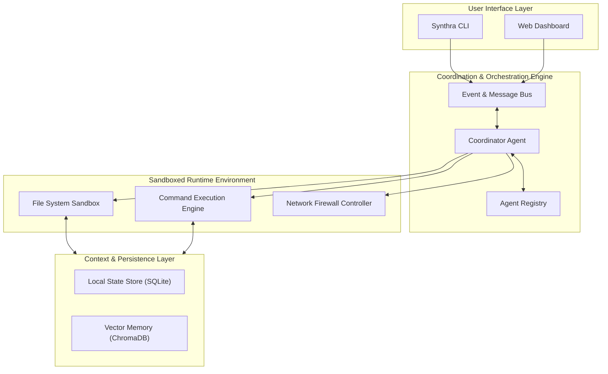
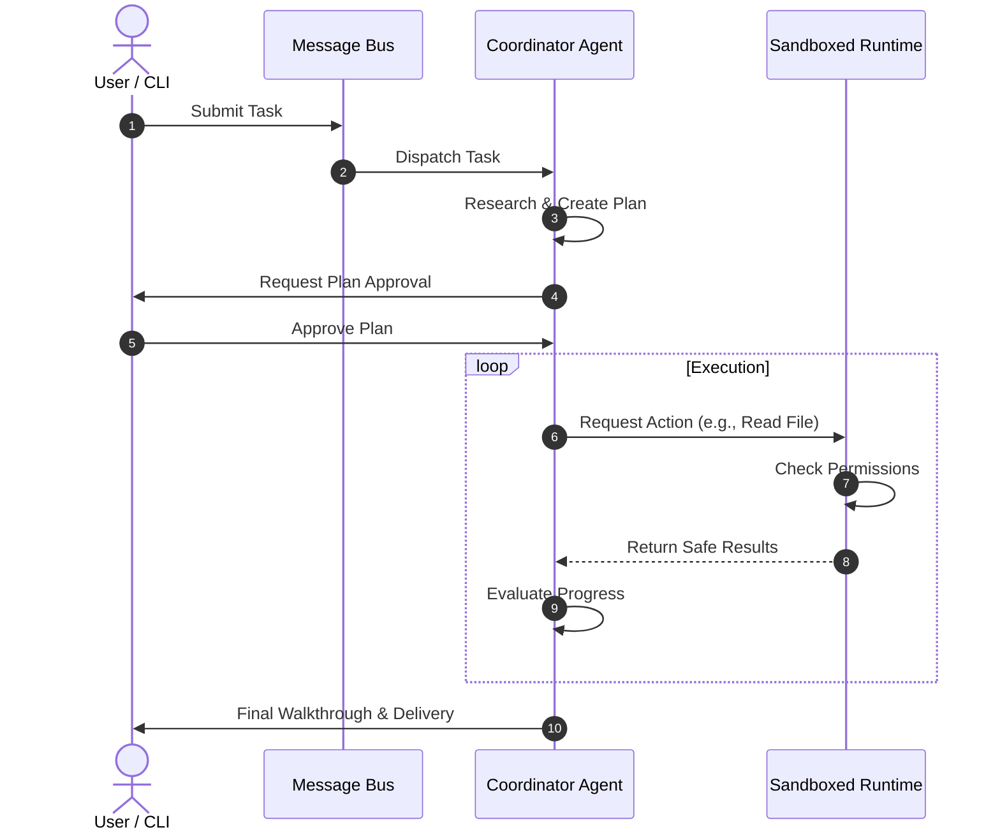

# Synthra Architecture Specification

> **Version:** 1.0.0  
> **Target Environment:** Node.js/Python  

---

## 🗺️ High-Level System Architecture

Synthra is divided into loose, decoupled layers to ensure flexibility and security. The following diagram illustrates the interaction between the user interface, the coordinator, sandboxed execution runtimes, and local storage layers:

---

## 🧩 Core Components

### 1. The Event & Message Bus
The central nervous system of Synthra. It handles routing between the user's interface, running agents, and system logs. It ensures all interactions are asynchronous, non-blocking, and fully audit-logged.

### 2. The Coordination Engine
*   **Coordinator Agent**: The primary entry point for solving a complex user request. It creates plans, delegates tasks to specialized subagents, and synthesizes the final outputs.
*   **Agent Registry**: Manages the available agent classes, their active states, and their communication tokens.

### 3. The Sandboxed Runtime
This layer intercepts all actions proposed by agents to ensure they conform to the security constraints outlined in the [Constitution](file:///c:/Users/VANDAN/Projects/SYNTHRA/docs/CONSTITUTION.md).
*   **File System Sandbox**: Restricts read/write operations to specific folders in the active workspace.
*   **Command Execution Engine**: Verifies commands against a blacklist before executing them via child processes.
*   **Network Firewall**: Blocks outbound traffic to unverified or dangerous domains, preventing data exfiltration.

### 4. Context & Persistence Layer
*   **Local State Store (SQLite)**: Persists active agent trees, session states, and command logs.
*   **Vector Memory**: Stores semantic embeddings of the codebase and historical task resolutions, allowing agents to retrieve relevant context on-demand.

---

## 🔄 Interaction Flow & Lifecycle

The lifecycle of a single user request follows a strict plan-verify cycle:

1.  **Task Ingest**: The user submits a request via the CLI.
2.  **Research & Plan**: The coordinator analyzes the project structure, retrieves context from vector memory, and generates an implementation plan.
3.  **Approval Lock**: Execution pauses until the user approves the plan.
4.  **Execute & Verify**: The coordinator runs actions inside the Sandbox. It parses results, runs validation tests, and corrects errors dynamically.
5.  **Delivery**: A detailed walkthrough is outputted to the user.
