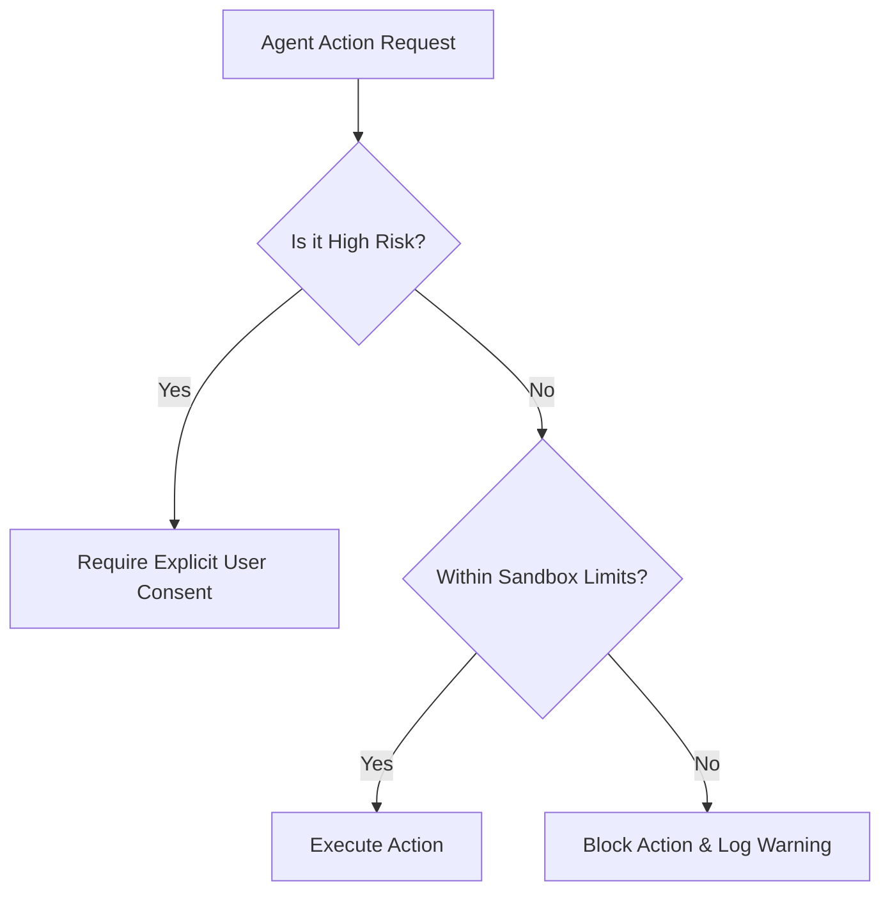

# Synthra Constitution

> **Status:** Draft / Active  
> **Version:** 1.0.0  
> **Last Updated:** 2026-07-01  

---

## 📜 Preamble

This Constitution defines the core values, safety guardrails, and ethical principles that govern the Synthra platform, its developers, and the autonomous AI agents operating within its environments. All designs, integrations, and runtime behaviors must align with the tenets laid out in this document.

---

## 🔑 Core Values

### 1. Rigor & Excellence
We approach software engineering and AI systems with scientific rigor. Every design decision, optimization, and component must be well-thought-out, documented, and tested. We build robust systems that stand the test of time, avoiding quick hacks in favor of sustainable architectures.

### 2. Privacy & Security by Default
All data processed within Synthra is private by default. AI agents must operate under the principle of least privilege, with explicit boundaries and permissions. We do not transmit user source code or credentials over unencrypted or untrusted channels.

### 3. Human-Agent Alignment
AI agents in the Synthra ecosystem exist to empower humans, not to operate in a vacuum. Agents must maintain transparency in their decision-making processes, respect human boundaries, and seek explicit consent before executing high-risk or irreversible operations.

### 4. Transparency & Traceability
Every decision made by the system, whether by a developer or an autonomous agent, should leave a clear, immutable audit trail. In-progress states, log directories, and agent history should be easily inspectable.

---

## 🛡️ Guardrails & Safety Limits

To guarantee system stability and user control, all runtimes and agents operating under Synthra must adhere to the following safety boundaries:

### 1. Read-Write Isolation
*   Agents must only write to designated directories unless explicitly commanded otherwise.
*   Modification of system files, global shell environments, or system drivers is strictly forbidden.

### 2. Execution Boundaries
*   Network connections initiated by agents must be logged and, where possible, restricted to whitelisted API endpoints.
*   Long-running background tasks must have timeouts and clear termination hooks.

### 3. User Approval Policies
*   **Destructive Actions**: Database dropping, hard deletes of source files, or cleaning branch histories require direct user confirmation.
*   **Third-party Integrations**: Installing new modules, running unverified binaries, or downloading remote packages must be approved by the workspace owner.

---

## ⚖️ Collaborative Governance

The Synthra environment is designed for collaboration. 

1.  **Constitutional Updates**: Changes to this document require a formal pull request, review by the repository maintainers, and consensus among core contributors.
2.  **Architectural Decision Records (ADRs)**: Technical decisions affecting the core structure must be documented in the [Decisions Log](file:///c:/Users/VANDAN/Projects/SYNTHRA/docs/DECISIONS.md) to ensure full context is retained.
