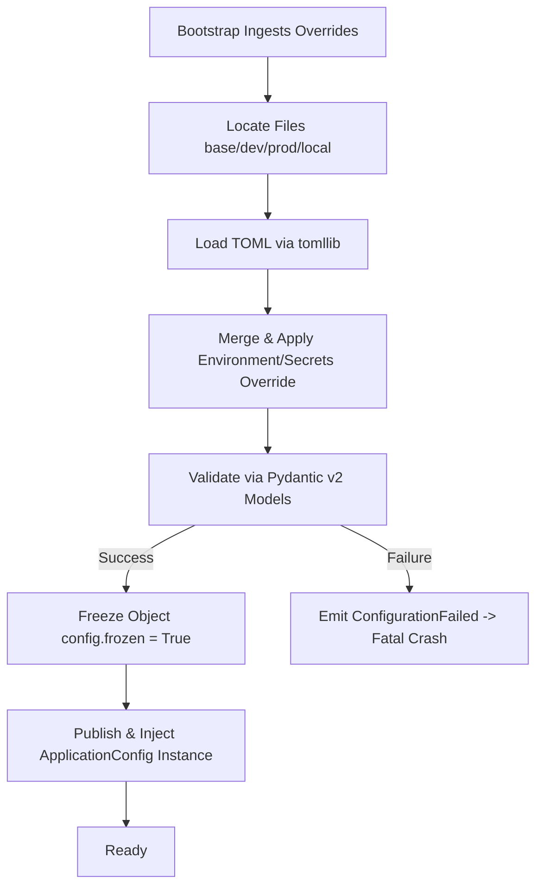

# DESIGN-0001 — Configuration Manager

---

```yaml
design:
  id: DESIGN-0001
  title: "Configuration Manager Infrastructure"
  version: 1.1
  status: Approved
  priority: Critical

owner: Project Architect
reviewer: Project Architect
implementer: Assigned Engineer

created: 2026-07-02
last_updated: 2026-07-02

depends_on: None
required_by: SPEC-0001, ALL_MODULES

estimated_complexity: Low
estimated_effort: 1.5 Days
```

---

## 🏛️ Boundary Validation Questions

1. **Why does this module exist?**
* *Answer*: Synthra requires a single, unified, deterministic, and strongly typed initialization state. It prevents silent parsing errors, type drift, and misconfiguration across parallel execution environments.

2. **Why is this the right boundary?**
* *Answer*: This module owns the *discovery, validation, precedence resolution, and freezing* of system settings. It explicitly does not handle CLI arguments, touch database layers, initialize directories, or load domain-specific quantitative logic.

3. **Could another module own this responsibility?**
* *Answer*: No. Decentralizing configuration parsing across downstream modules guarantees architectural fragility and secret leakage.

4. **What happens if this module disappears?**
* *Answer*: The system cannot securely bootstrap, locate its state, or cleanly load credentials, resulting in an immediate and fatal startup halt.

5. **Will we still like this design in two years?**
* *Answer*: Yes. Because it treats configuration as a generic infrastructure service completely decoupled from WorldQuant or domain-specific research models, the infrastructure can support any large-scale Python application.

---

# 1. Executive Summary

This design sets forth the specifications for Synthra's foundational configuration framework. It establishes a deterministic, fail-fast schema processor that uses Pydantic v2 to load structurally sound TOML configurations and mask environment-injected secret keys. The bootstrap process constructs exactly one immutable `ApplicationConfig` instance and injects it into dependent modules.

---

# 2. Problem Statement & Boundaries

Synthra's operational pipelines cross multiple environment states and interface with up to five different LLM orchestration APIs. We require a mechanism that eliminates chaotic environment variable management and configuration file mutation.

### Operational Constraints:

* Must execute within Python 3.11+ using native `tomllib`.
* Must enforce strict type and constraint checks prior to system bootstrapping.
* Must entirely prevent hardcoded API tokens or secret string persistence within configuration files.

---

# 3. Assumptions

* **A1**: The execution environment relies on standard environmental storage or a local `.env` block for runtime secrets.
* **A2**: Configuration settings are local and static throughout the entire execution lifetime of a single process runner.
* **A3**: Downstream modules interact purely with the unified, frozen configuration object via dependency injection and will never attempt manual file parsing.

---

# 4. Alternative Solutions Considered

### Decision Option: Configuration Format

* **D-001 (YAML)**: Highly nested, complex formatting option. Rejected due to over-engineering for flat technical namespaces.
* **D-002 (TOML) [Selected]**: Clean, standard-library native schema (`tomllib`), highly human-readable, and structurally deterministic.

### Decision Option: Validation Tooling

* **D-011 (Pydantic v2) [Selected]**: Native parsing coercion, explicit data constraints, out-of-the-box secret masking, and robust serialization.
* **D-012 (Standard Dataclasses)**: Lightweight, but rejected due to high validation boilerplate overhead when checking nested dictionary inputs.

---

# 5. Recommended Design & Rationale

**Selected Matrix Choices:** `D-002`, `D-011`, and dependency injection of the immutable top-level container.

The configuration framework will read structured domains directly from hierarchical `.toml` sheets, validate them via nested Pydantic models, inject environment secrets natively, block modifications dynamically, and pass a unified, frozen data container to the bootstrapper for module injection.

---

# 6. Detailed Component Design & Schema

### Configuration Ownership Schema

The Configuration Manager explicitly owns **`ApplicationConfig` ONLY**. All other domain-specific configs exist as child modules mounted underneath this root layer.

```text
ApplicationConfig
├── ApplicationSubConfig  # Basic application info, version metadata
├── RuntimeConfig         # Concurrency pools, thread execution limits
├── LoggingConfig         # Format streams, rotation schedules, telemetry hooks
├── StorageConfig         # Database paths, file lock thresholds, WAL settings
├── LLMConfig             # Token controls, temperature ceilings, provider credentials
├── SecurityConfig        # Encryption context blocks, access key parameters
├── PathConfig            # Absolute/Relative system path mapping boundaries
└── MonitoringConfig      # System health loops, performance counters
```

---

# 7. Data Flows & State Lifecycle

### 4-Tier Precedence Hierarchy (Highest to Lowest)

1. **Bootstrap Overrides** (Collected and explicitly injected by the bootstrap engine)
2. **Environment Variables / `.env` File** (For strict injections of execution tokens)
3. **Hierarchical TOML File Layer** (`local.toml` $\rightarrow$ `production.toml` / `development.toml` $\rightarrow$ `base.toml`)
4. **Internal Defaults** (Embedded standard definitions within the codebase schema)

### File System Layout

```text
config/
  ├── base.toml           # Common global configuration properties (Source-tracked)
  ├── development.toml    # Engineering testing parameters (Source-tracked)
  ├── production.toml     # Live execution configurations (Source-tracked)
  └── local.toml          # Machine-specific engineering overrides (Git-ignored)
.env.example              # Baseline variable blueprints (Source-tracked)
.env                      # Production / Local runtime credentials (Git-ignored)
```

### Lifecycle & Structural Flow



### Conceptual System Events

While not yet implemented at the infrastructure tier, the module defines the structural boundaries for these upcoming engine lifecycle hooks:

* `ConfigurationLoadingStarted`: Dispatched when the file lookup engine begins scanning `config/`.
* `ConfigurationLoaded`: Dispatched once raw TOML merging and environment parsing complete successfully.
* `ConfigurationValidated`: Dispatched immediately following successful Pydantic type-checks.
* `ConfigurationReady`: Dispatched after the `ApplicationConfig` instance is frozen and prepared for DI.
* `ConfigurationFailed`: Dispatched on any file parsing or verification breakages to guarantee immediate system halt.

---

# 8. Operational & Technical Risks

| Risk Category | Risk Description | Impact | Mitigation Strategy |
| --- | --- | --- | --- |
| **Security** | Accidental printing of sensitive tokens to log files. | Critical | Utilise Pydantic's `SecretStr` typing explicitly across all API credential definitions to automatically mask output values. |
| **Reliability** | Silently falling back to unwanted default settings. | High | Enforce a strict "Fail-Fast" loop; any schema mismatch, unmapped value, or unexpected configuration error triggers an explicit system crash. |

---

# 9. Configuration Evolution Strategy

* **Domain Additions**: New structural blocks must define a standalone child Pydantic configuration class block and be attached directly as an attribute root on the master `ApplicationConfig` layer.
* **Deprecation Paths**: Deprecated settings must be flagged via Python's standard `warnings` engine during the validation pass, and structures will be phased out across explicit version updates.
* **Schema Version Tracking**: The configuration structure tracks a top-level mandatory literal integer (`version = 1`) to serve as a gateway descriptor block for downstream automated data migraters if configuration paradigms break or evolve over time.

---

# 10. Core Infrastructure Design Principles

Every implementation line of the Configuration Manager must adhere directly to these seven core laws:

* **Immutable**: Once instantiated and verified, properties are fully write-blocked. No module may modify configuration at runtime.
* **Deterministic**: Identical environments and file inputs must yield identical configuration instances every single time.
* **Observable**: System startup logs must print a completely sanitized, safe configuration breakdown summary.
* **Generic**: The module must remain entirely agnostic of domain-specific research strategies, campaigns, or WorldQuant settings.
* **Injectable**: The configuration is constructed as a decoupled data structure that is injected into dependent modules rather than accessed via a Singleton.
* **Strongly Typed**: Every property must enforce rigorous static type typing, backed by stringently defined schemas.
* **Fail Fast**: The entry point must completely reject partial or malformed configurations. The application either boots flawlessly or stops instantly.

---

# 11. Exit Criteria

* [X] All boundary validation questions have been answered.
* [X] All alternative options (D-XXXX) have been documented and compared.
* [X] Recommended design rationale has been approved by the Architect.
* [X] All listed assumptions have been reviewed and validated.
* [X] All open questions have been resolved or closed.
* [X] Design document state transitions from Review to Approved or Frozen.
