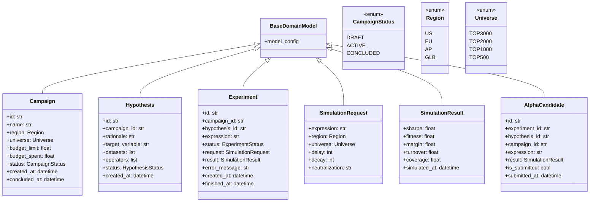

# DESIGN-0002 — Domain Models

---

```yaml
design:
  id: DESIGN-0002
  title: "Domain Models Definition"
  version: 1.1
  status: Frozen 🧊
  priority: Critical

owner: Project Architect
reviewer: Project Architect
implementer: Lead Engineer

created: 2026-07-02
last_updated: 2026-07-02

depends_on: DESIGN-0001
required_by: SPEC-0002, ALL_MODULES

estimated_complexity: Low
estimated_effort: 1 Day
```

---

## 🏛️ Boundary Validation Questions

1. **Why does this module exist?**
   - *Answer*: Synthra requires a single, unified, strongly typed semantic layer that governs the data representation of its quantitative research entities. This layer acts as the vocabulary for the entire system, preventing data structure fragmentation.

2. **Why is this the right boundary?**
   - *Answer*: This module defines the types, schemas, and immutability attributes of the system entities. It is strictly passive; it has no database dependencies, expression parsing rules, agent personas, or API client transport code.

3. **Could another module own this responsibility?**
   - *Answer*: No. If memory/database modules or simulation adapters define these structures, the models become tightly coupled to specific transport payloads or table definitions.

4. **What happens if this module disappears?**
   - *Answer*: The codebase will pass untyped dictionaries or loose JSON structures across agentic and execution layers, leading to silent validation failures, regression bugs, and semantic drift.

5. **Will we still like this design in two years?**
   - *Answer*: Yes. Pydantic v2 offers zero-boilerplate serialization, runtime type-safety, and structural freezing. Downstream applications can rely on standard Python models without knowing anything about the storage backends.

---

# 1. Executive Summary

This design defines the baseline data model layer of SYNTHRA. It details the properties, boundaries, and validation requirements for nine entities: `Campaign`, `Hypothesis`, `Experiment`, `SimulationRequest`, `SimulationResult`, `AlphaCandidate`, `Dataset`, `Operator`, and `ResearchAsset`. All models are implemented as immutable Pydantic structures.

---

# 2. Problem Statement & Boundaries

SYNTHRA is a distributed-agent quantitative research pipeline. When agents generate hypotheses or expressions, they must interact with memory systems and simulation clients in a safe, type-safe, and deterministic manner. 

Without a central definition of these models, the interfaces between the agents, the database, and the ACE simulation API will drift. This design solves these issues by establishing a single point of truth for type validation and serialization.

---

# 3. Assumptions

- **A1**: All domain models are immutable after instantiation (`frozen=True`) to prevent race conditions or unexpected mutations during parallel research campaign executions.
- **A2**: Standard ISO 8601 UTC datetime objects are used internally for all timestamp tracking.
- **A3**: Entity IDs conform to standardized alphanumeric prefixes (`CMP-XXXX`, `HYP-XXXX`, `EXP-XXXX`, `AST-XXXX`) to facilitate simple pattern matching and cross-referencing.
- **A4**: Enums are serialized directly by their string/primitive value (`use_enum_values=True`) to ensure database schemas and JSON payloads remain clean and deterministic.

---

# 4. Alternative Solutions Considered

### Decision Option: D-001 (Loose Python TypedDicts)
- **Overview**: Use standard Python `TypedDict` and type annotations.
- **Pros**:
  - Zero performance overhead.
  - No external library dependencies.
- **Cons**:
  - No runtime validation (only static checks).
  - No automatic deserialization or validation of complex fields (e.g. nested lists).

### Decision Option: D-002 (Pydantic v2 Models) [Selected]
- **Overview**: Use Pydantic `BaseModel` with strict validations.
- **Pros**:
  - Enforces runtime typing, field validation, and structural freezing (`frozen=True`).
  - Native serialization/deserialization methods (`model_dump`, `model_dump_json`).
  - Supports custom field validators (e.g. ID regex).
- **Cons**:
  - Small runtime instantiation overhead (highly optimized in Rust in Pydantic v2).

### Comparison Matrix

| Evaluation Metric | Option: D-001 | Option: D-002 |
| :--- | :--- | :--- |
| **Complexity** | Low | Low |
| **Type Rigor** | Low (Static Only) | High (Runtime + Static) |
| **Maintainability** | Medium (Manual validation required) | High (Auto-validation) |
| **Performance** | High | High (Negligible Pydantic overhead) |

---

# 5. Recommended Design & Rationale

**Selected: D-002 (Pydantic v2 Models)**.
Pydantic v2 guarantees absolute safety and structural integrity. By defining models as frozen Pydantic classes, we ensure that no agent or runner can mutate campaign or experiment records after instantiation, fulfilling the immutable data tenets in [ENGINEERING_PRINCIPLES.md](file:///c:/Users/VANDAN/Projects/SYNTHRA/docs/ENGINEERING_PRINCIPLES.md).

---

# 6. Detailed Component Design

All domain models inherit from a common base class, `BaseDomainModel`, which enforces global Pydantic configurations including immutability and enum serialization rules.



---

# 7. Data Flows & State Lifecycle

Domain models are instantiated and pass through state transitions within the planning and runner modules.

```
Draft Campaign (CMP-0001: draft)
       │
       ▼
Inquiry Formulation -> Hypothesis Created (HYP-0001: draft)
       │
       ▼
Experiment Initialized (EXP-0001: pending)
       │
       ▼
Simulation Requested (SimulationRequest) -> Dispatched to client
       │
       ▼
Simulation Completed (SimulationResult) -> Experiment Completed (EXP-0001: completed)
       │
       ▼
Check Performance Bounds -> AlphaCandidate Created (AST-0001 with embedded SimulationResult)
```

---

# 8. Operational & Technical Risks

| Risk Category | Risk Description | Impact | Mitigation Strategy |
| :--- | :--- | :--- | :--- |
| **Reliability** | Validation failures due to platform API changes or malformed inputs. | High | Strict field regex validation (e.g. `CMP-\d{4}`) to fail fast during instantiation. |
| **Maintainability** | Schema updates forcing database refactoring. | Med | Use standard Pydantic serialization, and enforce semantic schema versions inside the system core. |

---

# 9. Open Questions

- *None*.

---

# 10. References

- [Architecture Specification](file:///c:/Users/VANDAN/Projects/SYNTHRA/docs/ARCHITECTURE.md)
- [Constitution](file:///c:/Users/VANDAN/Projects/SYNTHRA/docs/CONSTITUTION.md)
- [Engineering Principles](file:///c:/Users/VANDAN/Projects/SYNTHRA/docs/ENGINEERING_PRINCIPLES.md)

---

# 11. Exit Criteria

- [X] All boundary validation questions have been answered.
- [X] All alternative options (D-XXXX) have been documented and compared.
- [X] Recommended design rationale has been approved by the Architect.
- [X] All listed assumptions have been reviewed and validated.
- [X] All open questions have been resolved or closed.
- [X] Design document state transitions from `Review` to `Approved` or `Frozen`.
