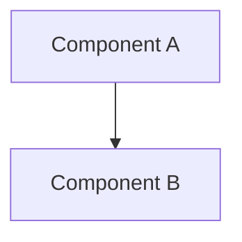

# DESIGN_TEMPLATE.md

---
design:
  id: DESIGN-XXXX
  title: "<Design Name>"
  version: 1.0
  status: Draft | Review | Approved | Frozen | Archived
  priority: Critical | High | Medium | Low

owner: Project Architect
reviewer: Project Architect
implementer: Claude Code

created:
last_updated:

depends_on:
required_by:

estimated_complexity:
estimated_effort:
---

# DESIGN-XXXX — <Design Name>

---

## 🏛️ Boundary Validation Questions

Prior to architectural review and approval, the designer must document the answers to these five boundary validation questions:

1.  **Why does this module exist?**
    - *Answer*: [Explain the core problem this module solves and its necessity.]
2.  **Why is this the right boundary?**
    - *Answer*: [Define what lies inside and outside of this module's scope.]
3.  **Could another module own this responsibility?**
    - *Answer*: [Justify why this module must own this responsibility instead of existing modules.]
4.  **What happens if this module disappears?**
    - *Answer*: [Describe the cascading failures or architectural impacts of its absence.]
5.  **Will we still like this design in two years?**
    - *Answer*: [Detail the extensibility and durability of this structural choice.]

---

# 1. Executive Summary

Provide a concise overview of the design goal and the choices resolved in this document.

Answer:
- What system components or patterns does this design address?
- Why is this design review happening now?
- What are the major conclusions of this design paper?

---

# 2. Problem Statement & Boundaries

Describe the architectural problem this design document resolves.
- Define what systems or modules are affected.
- Outline the technical constraints and performance requirements.

---

# 3. Assumptions

List the underlying technical, operational, and system assumptions that constrain this design:
- **A1**: [e.g. Configuration files are local and static during process initialization.]
- **A2**: [e.g. Execution runs in a single-process environment.]
- **A3**: [e.g. Code is compiled and executed exclusively in Python.]

---

# 4. Alternative Solutions Considered

This section is critical. Document at least two alternative design directions before selecting the recommended approach. Assign explicit Decision IDs to evaluate choices.

### Decision Option: D-001 [Name of Option A]
- **Overview**: Description of this approach.
- **Pros**:
  - ...
- **Cons**:
  - ...

### Decision Option: D-002 [Name of Option B]
- **Overview**: Description of this approach.
- **Pros**:
  - ...
- **Cons**:
  - ...

### Comparison Matrix

| Evaluation Metric | Option: D-001 | Option: D-002 |
| :--- | :--- | :--- |
| **Complexity** | Low/Med/High | Low/Med/High |
| **Maintainability** | Pros/Cons | Pros/Cons |
| **Extensibility** | Pros/Cons | Pros/Cons |
| **Performance** | Latency/Cost | Latency/Cost |

---

# 5. Recommended Design & Rationale

State the chosen solution explicitly (e.g. **Selected: D-002**). Justify why the recommended option was selected over the alternatives, referencing the engineering principles in [ENGINEERING_PRINCIPLES.md](file:///c:/Users/VANDAN/Projects/SYNTHRA/docs/ENGINEERING_PRINCIPLES.md).

---

# 6. Detailed Component Design

Detail the internal components, patterns, and data structures.
- **Component A**: Role and responsibility.
- **Component B**: Role and responsibility.

Include UML or Mermaid sequence/dependency diagrams if applicable:

---

# 7. Data Flows & State Lifecycle

Explain how information traverses the components.
- Outline object lifecycles, states, and transition boundaries.
- Define what events are emitted during state changes.

---

# 8. Operational & Technical Risks

Document the operational risks of the chosen approach.

| Risk Category | Risk Description | Impact | Mitigation Strategy |
| :--- | :--- | :--- | :--- |
| **Performance** | [e.g. Memory leak during sweep] | High/Med/Low | [e.g. Enforce memory thresholds] |
| **Operational** | [e.g. Rate limits exceeded] | High/Med/Low | [e.g. Retry queue configuration] |

---

# 9. Open Questions

List any unresolved technical questions or dependencies that need architectural feedback. Do not proceed to SPEC definition with open design questions.

---

# 10. References

- [Architecture Specification](file:///c:/Users/VANDAN/Projects/SYNTHRA/docs/ARCHITECTURE.md)
- [Engineering Principles](file:///c:/Users/VANDAN/Projects/SYNTHRA/docs/ENGINEERING_PRINCIPLES.md)
- Relevant ADRs or prior design papers.

---

# 11. Revision History

| Version | Date | Author | Summary |
| :--- | :--- | :--- | :--- |
| 1.0 | | | Initial Draft |

---

# 12. Exit Criteria

This design document is considered complete and approved for SPEC drafting only when:
- [ ] All boundary validation questions have been answered.
- [ ] All alternative options (D-XXXX) have been documented and compared.
- [ ] Recommended design rationale has been approved by the Architect.
- [ ] All listed assumptions have been reviewed and validated.
- [ ] All open questions have been resolved or closed.
- [ ] Design document state transitions from `Review` to `Approved` or `Frozen`.
