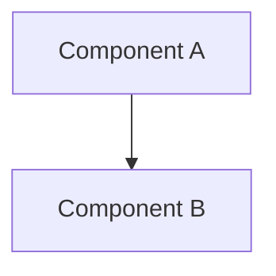

# DESIGN_TEMPLATE.md

---
design:
  id: DESIGN-XXXX
  title: "<Design Name>"
  version: 1.0
  status: Draft | Review | Approved | Frozen | Archived
  priority: Critical | High | Medium | Low

owner: Project Architect
reviewer: Project Architect
implementer: Claude Code

created:
last_updated:

depends_on:
required_by:

estimated_complexity:
estimated_effort:
---

# DESIGN-XXXX — <Design Name>

---

## 1. Executive Summary

Provide a concise overview of the design goal and the choices resolved in this document.

Answer:
- What system components or patterns does this design address?
- Why is this design review happening now?
- What are the major conclusions of this design paper?

---

## 2. Problem Statement & Boundaries

Describe the architectural problem this design document resolves.
- Define what systems or modules are affected.
- Outline the technical constraints and performance requirements.

---

## 3. Alternative Solutions Considered

This section is critical. Document at least two alternative design directions before selecting the recommended approach.

### Alternative A: [Name]
- **Overview**: Description of this approach.
- **Pros**:
  - ...
- **Cons**:
  - ...

### Alternative B: [Name]
- **Overview**: Description of this approach.
- **Pros**:
  - ...
- **Cons**:
  - ...

### Comparison Matrix

| Evaluation Metric | Alternative A | Alternative B | Recommended Approach |
| :--- | :--- | :--- | :--- |
| **Complexity** | Low/Med/High | Low/Med/High | Low/Med/High |
| **Maintainability** | Pros/Cons | Pros/Cons | Pros/Cons |
| **Extensibility** | Pros/Cons | Pros/Cons | Pros/Cons |
| **Performance** | Latency/Cost | Latency/Cost | Latency/Cost |

---

## 4. Recommended Design & Rationale

Justify why the recommended design was selected over the alternatives. Explain how it optimizes the engineering principles defined in [ENGINEERING_PRINCIPLES.md](file:///c:/Users/VANDAN/Projects/SYNTHRA/docs/ENGINEERING_PRINCIPLES.md).

---

## 5. Detailed Component Design

Detail the internal components, patterns, and data structures.
- **Component A**: Role and responsibility.
- **Component B**: Role and responsibility.

Include UML or Mermaid sequence/dependency diagrams if applicable:

---

## 6. Data Flows & State Lifecycle

Explain how information traverses the components.
- Outline object lifecycles, states, and transition boundaries.
- Define what events are emitted during state changes.

---

## 7. Operational & Technical Risks

Document the operational risks of the chosen approach.

| Risk Category | Risk Description | Impact | Mitigation Strategy |
| :--- | :--- | :--- | :--- |
| **Performance** | [e.g. Memory leak during sweep] | High/Med/Low | [e.g. Enforce memory thresholds] |
| **Operational** | [e.g. Rate limits exceeded] | High/Med/Low | [e.g. Retry queue configuration] |

---

## 8. Open Questions

List any unresolved technical questions or dependencies that need architectural feedback. Do not proceed to SPEC definition with open design questions.

---

## 9. References

- [Architecture Specification](file:///c:/Users/VANDAN/Projects/SYNTHRA/docs/ARCHITECTURE.md)
- [Engineering Principles](file:///c:/Users/VANDAN/Projects/SYNTHRA/docs/ENGINEERING_PRINCIPLES.md)
- Relevant ADRs or prior design papers.

---

## 10. Revision History

| Version | Date | Author | Summary |
| :--- | :--- | :--- | :--- |
| 1.0 | | | Initial Draft |
